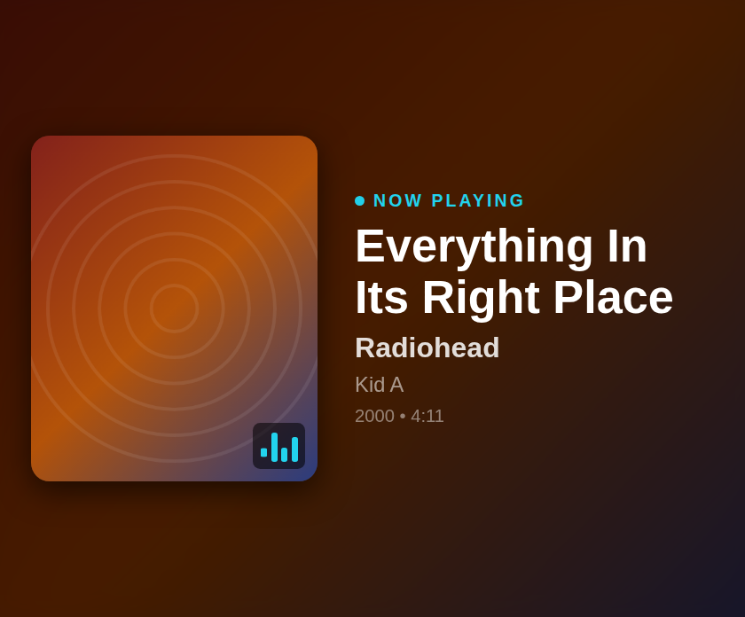

# Feishin Now Playing — iCUE Widget for Xeneon Edge

A now-playing widget for **Feishin / Navidrome** on the CORSAIR Xeneon Edge: big album art with a blurred art backdrop, track / artist / album, an animated EQ badge, and a recently-added strip when nothing is playing.

Feishin is a client — the listening data lives on the **Navidrome** (or any Subsonic-compatible) server it points at. This widget queries that server directly via the Subsonic API (`getNowPlaying`), so it shows whatever Feishin (or any other client) is scrobbling, with zero companion services.

## Features

- **Now playing**: album art, title (2-line clamp), artist, album, year • duration • freshness
- Blurred album-art backdrop for an ambient look
- Animated EQ bars overlay + pulsing NOW PLAYING dot
- **Idle state**: "Nothing playing" with your 8 most recently added albums
- "Only My Plays" switch to ignore other users on a shared server
- Subsonic **salted-token auth** (`t = md5(password + salt)`) — your password is never sent
- Responsive: art-left on landscape, art-top on portrait, all Edge slot sizes
- Personalization: colors, background image, glass blur, transparency

## Setup

1. `icuewidget package icue-widget-feishin` → double-click to install (iCUE 5.44+)
2. Add to a Xeneon Edge slot → settings:
   - **Navidrome Server URL** (e.g. `https://navidrome.example.com`)
   - **Username** / **Password** (a dedicated read-only Navidrome user works great)

Requires the Navidrome server to send CORS headers (Navidrome does by default: `Access-Control-Allow-Origin: *` on `/rest`).

## Settings

| Setting | Type | Default | Description |
|---------|------|---------|-------------|
| Navidrome Server URL | text | — | Your server, HTTPS recommended |
| Username / Password | text | — | Subsonic credentials |
| Only My Plays | switch | on | Filter `getNowPlaying` to your user |
| Refresh Interval | slider | 10 s | 5–60 s |
| Text / Accent / Background Color | color | white / `#22d3ee` / `#15161c` | |
| Background Image + Glass Blur | media | — | Shown behind the art backdrop |
| Background Transparency | slider | 100% | |

## States

Connecting · Setup (missing credentials) · Now playing · Idle (recently added) · Error (bad credentials / unreachable)

## Privacy

Talks only to the server you configure. Credentials live in iCUE widget settings; auth uses Subsonic salted tokens so the raw password never crosses the wire.

## License

MIT
